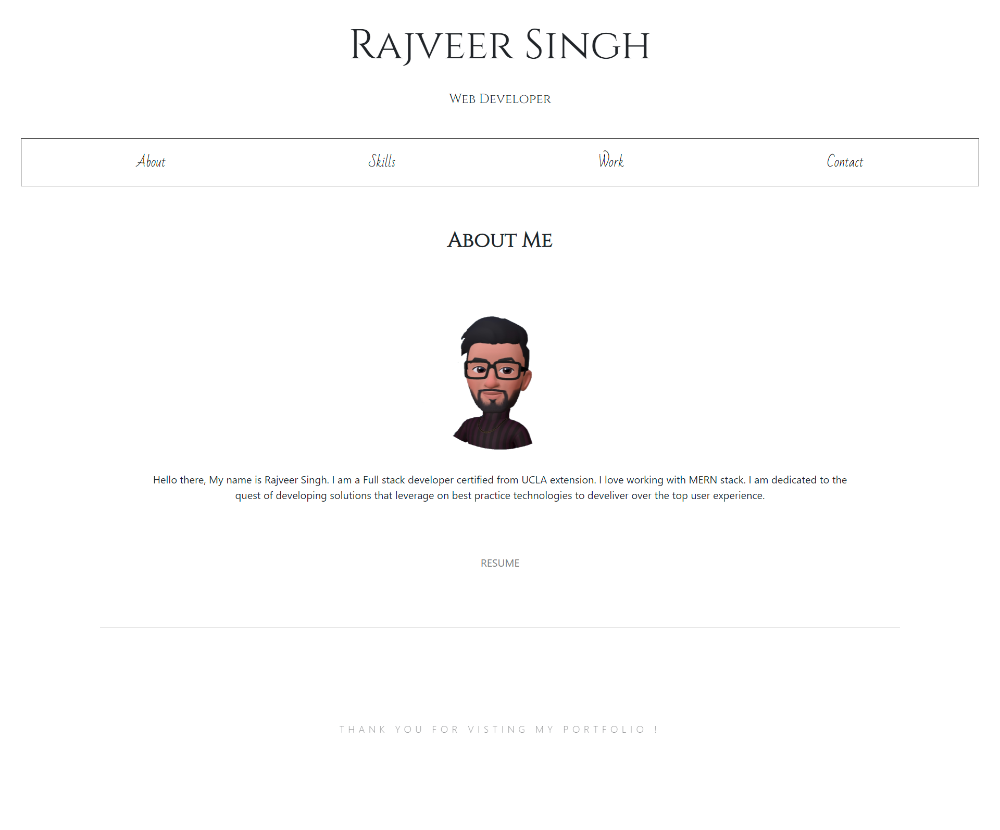
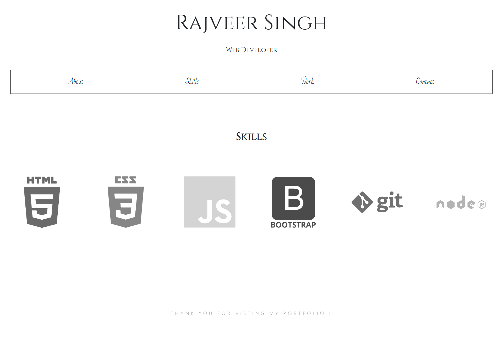
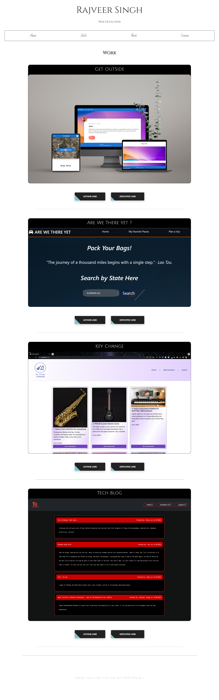
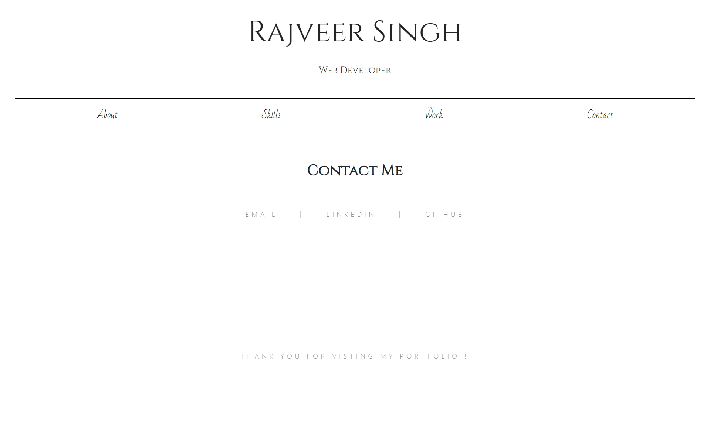

# React Portfolio

  ## 
    THIS APPLICATION  IS COVERED UNDER THE MIT LICENSE

---
## Figma Prototype :

## Description
#### This is a portfolio made with react. 

## Table of Contents:
  - [Description](#description)
  - [Technologies Used](#technologies-used)
  - [Installation](#installation)
  - [Links](#links)
  - [Screenshot](#screenshot)

- [Questions?](#questions)

## Technologies Used:
- REACT
- CSS

## Installation:
### This is a webpage. No installtion necessary. Visit this website by clicking on the deployed link.

---
## Links:

- [Github Link]()
- [Deployed link]()

---
## Screenshot

---

## Questions?
If you have any additional questions, please reach me at rajsidhu2924@gmail.com

OR
 

[Github](https://www.github.com/rajveer-s)

